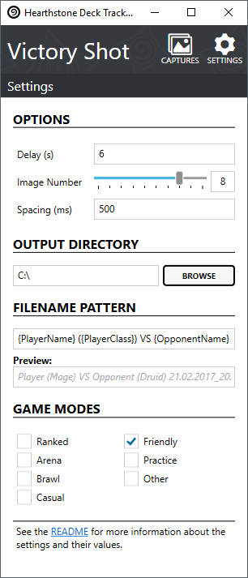

## Victory Shot
[](https://ci.appveyor.com/project/andburn/hdt-plugin-victoryshot)
[](https://codecov.io/gh/andburn/hdt-plugin-victoryshot)
[](https://github.com/andburn/hdt-plugin-victoryshot/releases/latest)
[](https://github.com/andburn/hdt-plugin-victoryshot/releases/latest)

A [Hearthstone Deck Tracker](https://hsdecktracker.net/) plugin that that takes screenshots at the end of a match.

---

## Install
1. Remove any previous versions of this plugin from `%AppData%HearthstoneDeckTracker\Plugins`
- Download the [latest release](https://github.com/andburn/hdt-plugin-victoryshot/releases/latest) of this plugin (*not the source code*).
- Unzip the contents into you Hearthstone Deck Tracker's plugins folder.
- Enable the plugin in HDT's settings.

See the HDT plugin [wiki page](https://github.com/HearthSim/Hearthstone-Deck-Tracker/wiki/Available-Plugins#how-to-install-plugins) for more information on installing and using plugins.

## Usage
When the plugin is enabled it will take a series of screenshots at the end of a game allowing you to select one to save.


There is a time delay between HDT detecting the end of a game and the actual display of the Victory/Defeat screen. This delay can vary depending on the game and game mode. The settings may need to be tweaked to better suit your system.



- *Delay* specifies the number of seconds to wait from the detected end of game to the actual display on screen.
- *Image Number* is the number of images to take in sequence. (If this is set to 1 the end game dialog is not shown, but the screenshot is still saved).
- *Spacing* is the time to wait in between each image snapshot, in milliseconds (1000 ms = 1 second).
- *Set Output Directory* allows you to set the default save directory for screen shots (defaults to the Desktop).
- *Filename Pattern* customization of screenshot filename (see below).
- *Game Modes* selection of game modes that you want to capture end game screenshots.
- *Alt Capture* if you are having problems with screenshots, such as them appearing black, untick this option.

#### File Naming Pattern
The file name pattern accepts the following special strings:
- **{PlayerName}** Your Battle.net username.
- **{PlayerClass}** The class you are currently playing.
- **{OpponentName}** The opponents username.
- **{OpponentClass}** The opponents class.
- **{Date:<date_format>}** The date/time when the screenshot was taken, uses the standard date formatting patterns.

**Example**: the default pattern is of the following format:
```
{PlayerName} ({PlayerClass}) VS {OpponentName} ({OpponentClass}) {Date:dd.MM.yyyy_HH.mm}
```
This would make the file name be something like:
```
Player1 (Mage) VS Player2 (Warlock) 12.08.2015_22:00.png
```

## Build
- You may need to first do a `git submodule update --init --recursive` to get some build scripts.
- Before opening the solution, you need to run the `bootstrap.ps1` powershell script to initialize a project dependency (*git* is required for the script to run).
- In order to build this plugin you'll will need to add references to *HearthstoneDeckTracker.exe* in multiple projects of the solution.
  - The yellow triangle icons in visual studio in a projects references tree will indicate what files need to be referenced and where.

---

## License
The plugin is licensed under the terms of the MIT license.

## Attribution
This plugin uses [IcoMoon](https://icomoon.io/) free font icons licensed under [CC BY 4.0](https://creativecommons.org/licenses/by/4.0/)
